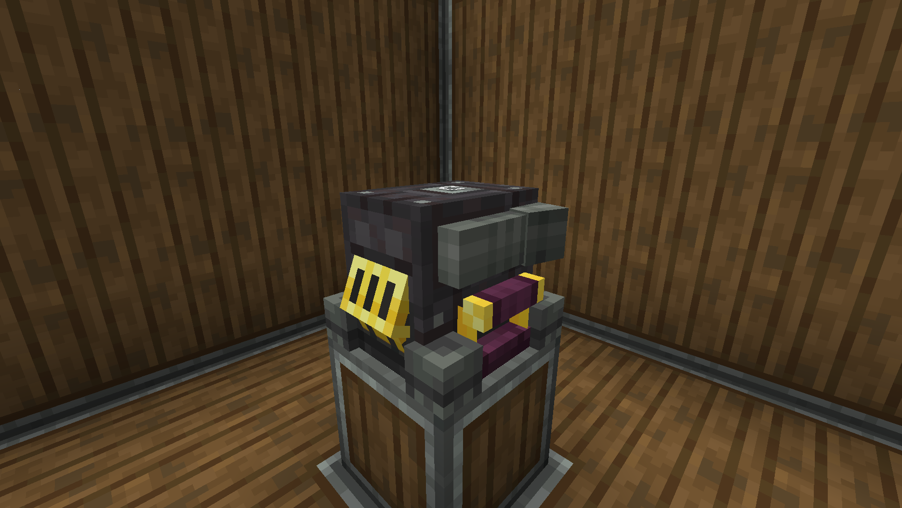
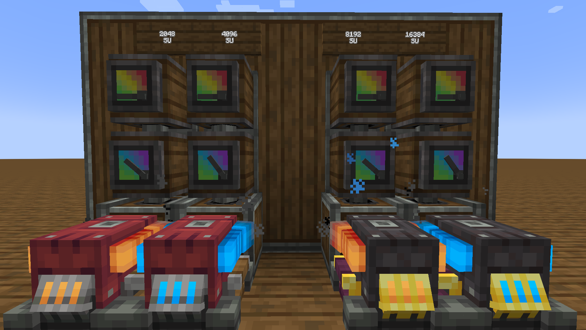
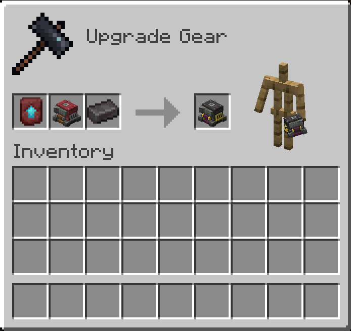

# Create: Netherite Portable Engine


A small Create Simulated addon that adds a netherite portable engine.

## Description

The mod adds the **Netherite Portable Engine** block, which is four times more powerful than a regular Portable Engine. Like other netherite gear, it is upgraded on a smithing table using a Netherite Upgrade Smithing Template and a Netherite Ingot.

## Images

### Netherite Portable Engine


### Power comparison


### Crafting


## Build

```bash
./gradlew runData
./gradlew build
```

The built `.jar` will be in `build/libs`.
